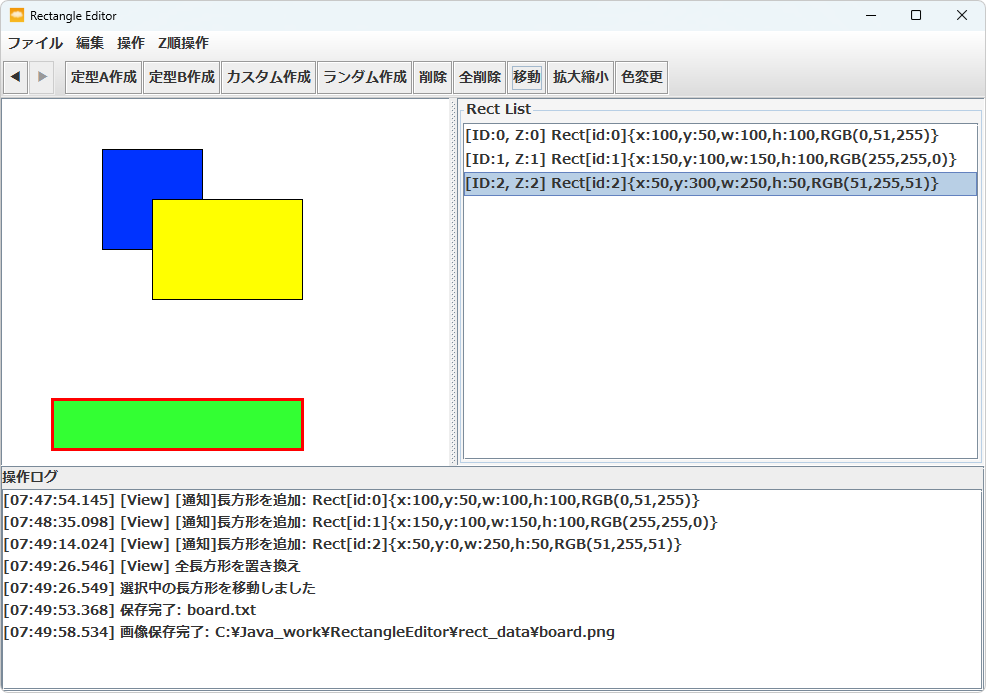

# 長方形エディタ

Java + Swing による GUI アプリケーションです。  
MVC構造を意識して設計・実装しています。

---

## 🎯 特徴・目的

- **GUIアプリ開発とMVC設計の一連の工程**（設計 → 実装 → テスト）を通じて実践力を高めることを目的とした自作プロジェクトです。
- 特に、「**何をどう作るかを自分で決めて構成する**」という上流の設計プロセスを体験することを重視しました。
- ユーザーが**直感的に操作できるUI**を目指し、以下のような操作に対応しています。
  - キャンバス上のクリックによる選択
  - リスト上の選択と Ctrl+クリックでの**横断的な複数選択**
- **選択状態・見た目・操作性**を同期させるため、イベント駆動の同期処理には特に力を入れました。
  - モデル上の状態変化
  - キャンバス上の視覚的な強調表示
  - リスト上の選択反映
  → これらを整合させ、**思い通りに操作が反映される設計**を実現
- モデル層における**単体テストを充実**させることで、ロジックの正当性を検証した上で GUI 実装を進める構成としました。

---

## 🖼️ 画面イメージ

---

---

## ⚙️ 主な機能

### ファイル操作
- ファイルを開く（独自テキスト形式）
- ファイルを保存
- PNG画像として保存

### 編集操作
- Undo / Redo（スナップショット方式）

### 長方形の作成・操作
- 長方形の作成（定型サイズ・ランダム）
- 長方形の移動・拡大・縮小・色変更
- 長方形の削除（選択中・全削除）
- Z順変更（最前面／最背面／一つ前／一つ後）

### 選択とUI連携
- キャンバス上でのクリック選択
- リスト上での選択
- Ctrl+クリックによる複数選択対応
- 空白クリックや ESCキー で選択解除
- 選択状態に応じたボタンの有効・無効切り替え

---

## 🧱 技術構成

- Java 17（※ビルド・実行環境は Java 21）
- Swing
- Maven（ビルド管理）
- JUnit（単体テスト）

---

## 📁 ディレクトリ構成（抜粋）

rectangleEditor/  
├── app/ // エントリポイント  
├── controller/ // 入力・操作の中継  
├── model/ // 状態管理・ロジック  
├── view/ // GUI構築  
├── handler/ // 各操作の実行ロジック  
└── test/ // 単体テスト  

---

## 📌 補足事項

- Undo/Redo はコマンドオブジェクトではなく、**状態スナップショット方式**で実装
- `Rect` クラスは**値オブジェクト**として設計
- UIイベント駆動における**同期処理と状態管理の分離**を強く意識
- 状態更新通知は**リスナーによる連携機構**で構築

---

## 📚 参考文献

本アプリケーションの設計題材には、以下の図書にて紹介されていた例を参考にしました。  
実装コードはすべて自身で調査・構築したものです。

- 松浦 佐江子 著『ソフトウェア設計論 - 役に立つUMLモデリングへ向けて -』コロナ社

## 📝 ライセンス

このプロジェクトは個人の学習・作品展示目的で公開しており、商用利用はご遠慮ください。
